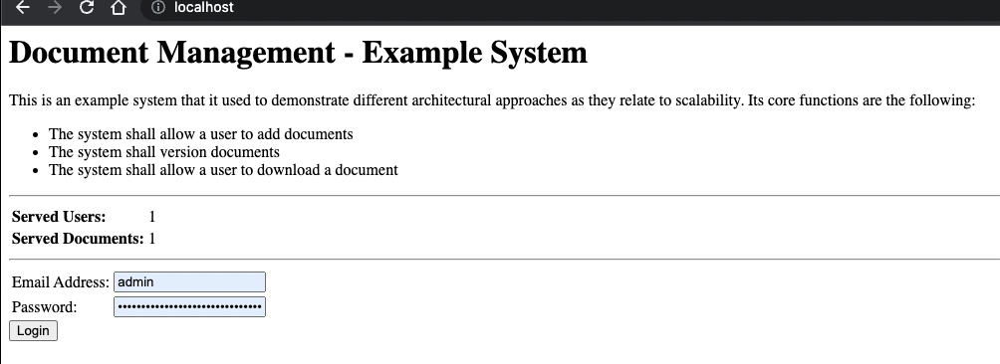
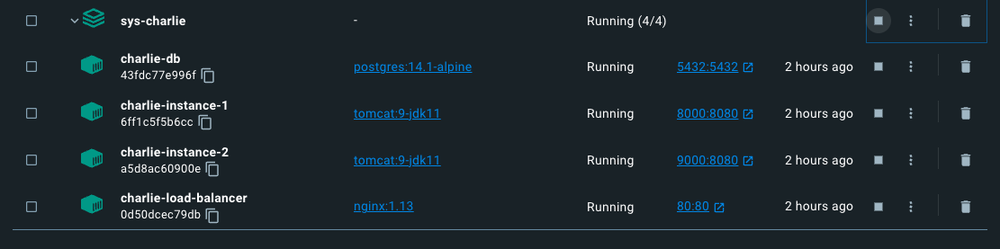

# System Charlie

Prerequisites

- https://github.com/jvalentino/sys-alpha-bravo

This is an example system that it used to demonstrate different architectural approaches as they relate to scalability. Its core functions are the following:

- The system shall allow a user to add documents
- The system shall version documents
- The system shall allow a user to download a document

This specification implementation uses a load balancer to support multiple concurrent instances.

## Previous System


With the implementation being:


## Current System

**Multi-Backend (Rating: a hundred)**

Now to tackle the fact that we need more servers (and instances) to handle user load, we start adding more servers to run more backend instances. The result though is that we need a way to direct traffier to the appropriate instance based on load, which is where we get Load Balancers. A consequence though of using a load balancer with in-memory sessions though, is that only the instance which handles the initial user authentication has knowledge of that session, so that user is tied to that instance.

[](https://github.com/jvalentino/clothes-closet-wiki/blob/main/wiki/step-3.png)

Pros

- Backend and Database independent, allowing us have different optimized servers.
- Multple backends allows us to handle more load from users.

Cons

- No separation between front-end and backend.
- Incentivizes a snowflake architecture by having to fine tune the server hardware differently.
- Session is maintained in server-memory, thus limiting the number of concurrent users.
- You are paying for that second instance even when you don't need it.
- The more data that goes into the database, the slower it performs.
- The database is now a prime bottlekneck.
- Core reliance on RDMS limits upper scalability.

# Architecture

The code-level implementation is the exact same as the previous example, with the exception of making the application's hostname for the database something that can be picked up as an environment variable (via application.properties):

```properties
spring.datasource.url=jdbc:postgresql://${DB_HOST:localhost}:5432/examplesys
```

The resulting architecture then looks like this:


However, this probably doesn't make all the Docker magic clear, especially if you are not familiar with Docker. This is because Docker is being used to stitch all this together, while also making each part of the architecture accessible via localhost. The result is this:


## db

The datbase is the same, which is running Postgres in its own container, with it operating within the container on port 5432, which is also exposed locally on that same port.

This allows you to connect to it using pgadmin for eample:


## instance1

This is running a Tomcat Application Server on its default port of 8080, which is then exposed locally as 8000 so that you can hit it directly in the web browser.


## Instance2

This is running a Tomcat Application Server on its default port of 8080, which is then exposed locally as 9000 so that you can hit it directly in the web browser.


## nginx

This is running nginx, but instead of as a standard web server it is acting as a load balancer. It is exposed locally on port 80, so when you go to http://localhost it will forward behind the scenes to one of the two Tomcat instances.



However, because we are managing session information in memory, if we were to change instances after login that session would be loss. For this reason we are using "sticky session", which means once you are directed to a specific instance of Tomcat you are stuck on that one.

# Developer

rerequisites

- Java
- IntelliJ
- Docker
- Docker Compose
- pgadmin
- Git

All of these you can get in one command using this installation automation (if you are on a Mac): https://github.com/jvalentino/setup-automation

## Database

You launch the database container by running:

```bash
docker compose up -d
```

This sill execute the container in detetached mode, and leave it running in the background.

You then have to manually create a database name `examplesys`, which is most easilly done via pgadmin:


## IDE Testing

This imports as a standard Gradle project, in which you are able to easily execute tests:

[](https://github.com/jvalentino/sys-alpha-bravo/blob/main/wiki/testing.png)

## Runtime

However, running this thing requires an embedded Tomcat container, which I could only get working via the Gradle Plugin, which means I had to setup a Gradle task to run `tomcatRunWar`:

[](https://github.com/jvalentino/sys-alpha-bravo/blob/main/wiki/gradle.png)

IT doesn't shutdown nicely, to be prepared to run this command over and over again to kill it: `pkill -f tomcat`

You can otherwise do this at the command-line using `./gradlew tomcatRunWar`

## Verification

[](https://github.com/jvalentino/sys-alpha-bravo/blob/main/wiki/ide_check.png)

Running check will execute both testing and static code analysis via the build.

This is otherwise the same as doing this at the command-line: `./gradlew check`

## Strategy

Codenarc is used to ensure that no common coding issues can be added.

Jacoco is used to enforce that line coverage is over 85%.

Tests that end in "IntgTest" are used for integration testing via Spring Boot Test, otherwise they are unit tests.

Every code commit triggers a Github Action pipeline that runs the entire build process.

## Full System

You can run the entire system locally via Docker, but executing this script:

```bash
./run-system.sh
```

This just builds the war file and then execute the docker compose file that contains the system:

```bash
./gradlew clean build
docker compose -f docker-compose-system.yaml up -d
```

### Docker Compose

The real magic is in this docker compose file, which:

- **db** - Runs PostgreSQL on port 5432, which also keeps the data locally in ./dev-db
- **instance1** - Runs a Tomcat 9 container that is exposed on port 8000, and that also copies the WAR file from the gradle build into its run directory as ROOT.war. This is what makes the application run at / instead of /the-war-name.
- **instance2** - Runs the same Tomcat 9 container as a second instance, that is also exposed on port 9000.
- **nginx** - Runs a web server container to act as a load balancer, with a custom configuration file.

```yaml
version: '3.8'
services:
  db:
    container_name: charlie-db
    image: postgres:14.1-alpine
    restart: always
    environment:
      - POSTGRES_USER=postgres
      - POSTGRES_PASSWORD=postgres
    ports:
      - '5432:5432'
    volumes:
      - ./dev-db:/var/lib/postgresql/data

  instance1:
    container_name: charlie-instance-1
    image: tomcat:9-jdk11
    ports:
      - '8000:8080'
    environment:
      DB_HOST: db
    volumes:
      - ./build/libs/sys-charlie-0.0.1.war:/usr/local/tomcat/webapps/ROOT.war
    depends_on:
        - db

  instance2:
    container_name: charlie-instance-2
    image: tomcat:9-jdk11
    ports:
      - '9000:8080'
    environment:
      DB_HOST: db
    volumes:
      - ./build/libs/sys-charlie-0.0.1.war:/usr/local/tomcat/webapps/ROOT.war
    depends_on:
      - db

  nginx:
    container_name: charlie-load-balancer
    image: nginx:1.13
    ports:
      - "80:80"
    volumes:
      - ./config/nginx/nginx.conf:/etc/nginx/nginx.conf
    depends_on:
      - db
      - instance1
      - instance2

```

### nginx

I mostly just copied this from stack overflow, as getting sticky sessions to work was not easy.

```
events { worker_connections 1024;}
error_log ... debug;
# https://serverfault.com/questions/832790/sticky-sessions-with-nginx-proxy
http {
    upstream nginx {
        ip_hash;
        server instance1:8080;
        server instance2:8080;
        keepalive 8;
    }
    server {
        listen 80;

        proxy_set_header Upgrade $http_upgrade;
        proxy_set_header Connection "upgrade";

        proxy_set_header X-Real_IP $remote_addr;
        proxy_set_header X-Forwarded-For $proxy_add_x_forwarded_for;
        proxy_set_header Host $http_host;
        proxy_set_header X-NginX-Proxy true;

        # This is necessary to pass the correct IP to be hashed
        real_ip_header X-Real-IP;

        location / {
            proxy_pass http://nginx;
        }

        proxy_redirect off;
    }
}
```

### Debugging

Docker Desktop is your friend:



From here you can access the individual logs and underlying container runtime environments, easily.